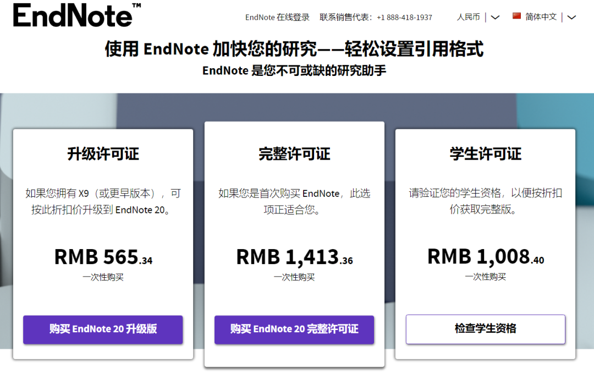
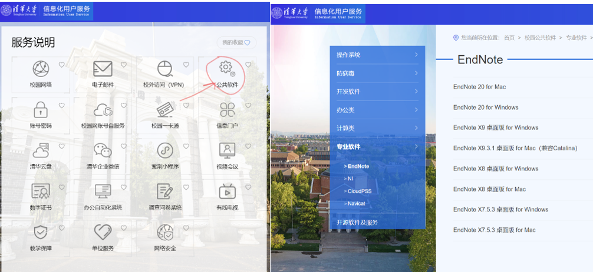
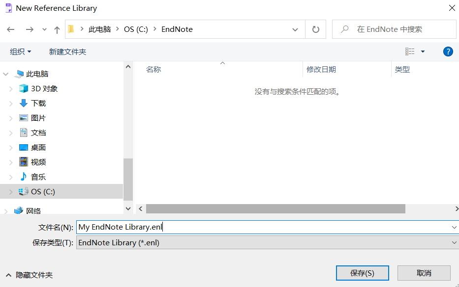
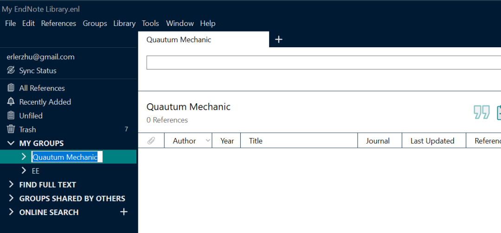
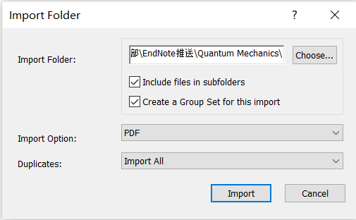
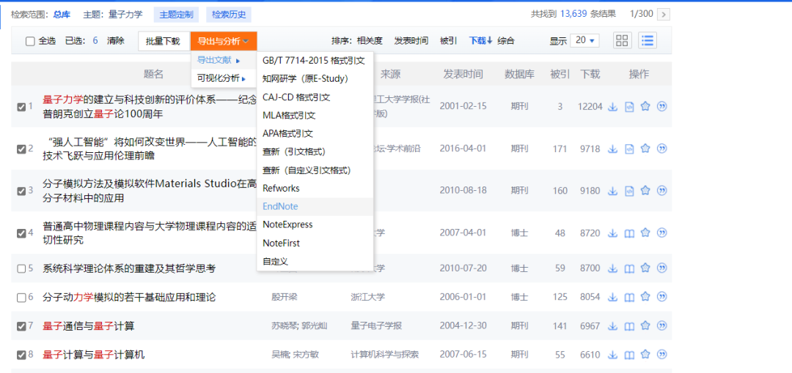
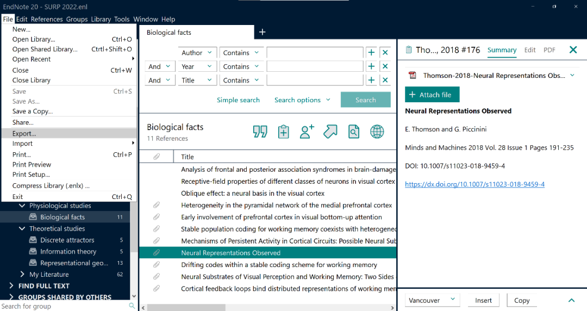
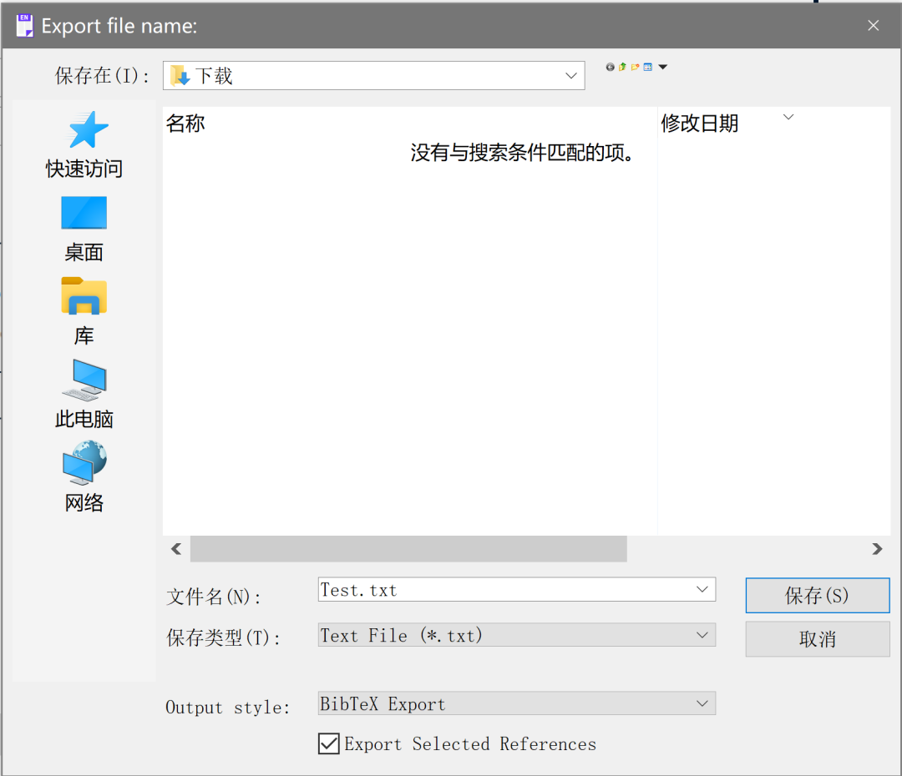
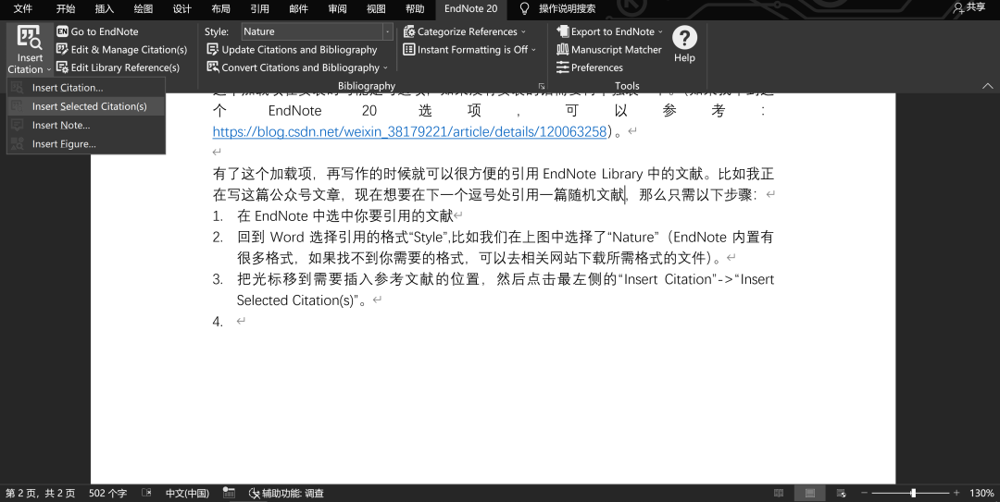
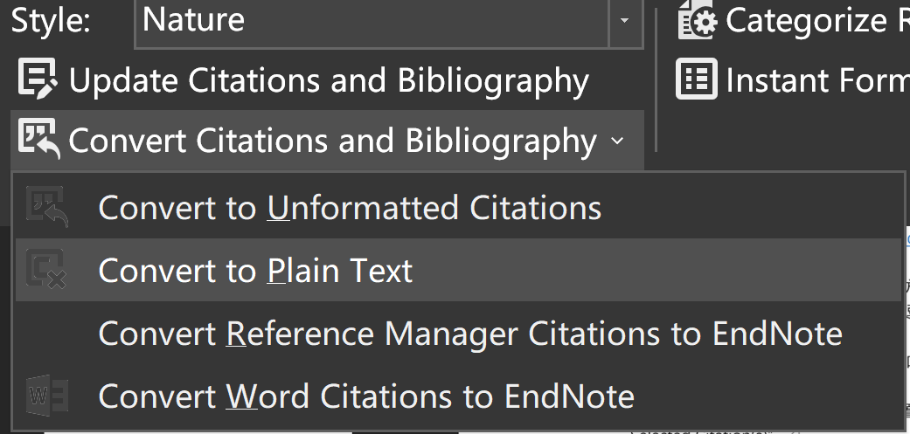

# 你的宝藏文献管理工具 EndNote

> 转载自 THU长乐未央 公众号. 作者：未央学术

如果你在实验室搬砖、学习探究性课程时面对着大量文献而不知所措，或是在论文写作时对文献的引用感到麻烦，那么这篇推送或许能帮助到你。

未央科协学术部的同学将会从软件下载开始，一步步教会你如何上手EndNote这款科研软件，帮助你更高效地管理文献和撰写论文。

!!! tip
    温馨提示，阅读文本大约需要20-30min

## 01 软件介绍
EndNote来源于英文单词 endnote（尾注），是一款由ThomsonCorporation下属的Thomson ResearchSoft子公司开发的一款学术软件，也是SCI的官方软件。

EndNote的主要功能有: 

1. 在线搜索文献在线搜索文献：直接从网络搜索相关文献并导入到Endnote的文献库内

2. 建立文献库和图片库：收藏，管理和搜索个人文献和图片、表格;

3. 定制文稿：直接在Word中格式化引文和图形，利用文稿模板直接书写合乎杂志社要求的文章;

4. 引文编排：可以自动帮助我们编辑参考文献的格式

......

这些功能能帮助我们高效地管理文献，也让我们的科研探究和学术写作变得更加便捷。接下来，让我们从软件的下载开始，踏上EndNote的学习之旅吧~

## 02 安装流程

点开EndNote官网，你会看到：

别担心，虽然EndNote的售价并不便宜，但世一大早已经帮同学们买好了，大家只要照着下面几个步骤依次进行，就能顺利安装好最新版本EndNote20。

1. 打开清华大学信息化用户服务平台，点击公共软件->专业软件->EndNote

2. 根据电脑操作系统选择EndNote版本，本文以Windows为例（MacOS同理），点击EndNote 20 for Windows，网站会自动下载安装包。

3. 下载完后点开EndNote20InstallerForWin.zip，将其存在合适位置后随后进行解压，可以看到以下文件:

4. 根据”Windows用户安装说明.txt”的提示完成endnote的安装。

!!! tip
    注: 学校下载的EndNote20是全英界面的，本文也是基于英文界面进行介绍，网络上有EndNote X9等前置版本的汉化版，功能与20相近。

## 03 导入文献
点开EndNote官网，你会如下界面:

EndNote使用library来对文献进行管理，所以我们先要创建一个library。点击左上角File->new, 会出现以下界面:

选择保存路径后点击保存, EndNote会自动生成两个文件：
!!! tip
    注: 我这里保存的是C盘, 因为我的电脑只有一个盘; 如果你的电脑已经分好盘了，建议你保存在D盘。这里默认创建的library名称为My Endnote Library, 你也可以修改它。

你的文献数据保存在`*.Date`中，而`*.enl`文件可以帮助你在EndNote中打开library。如果你需要更改文件位置，请将两个文件一并更改。

创建好library后，我们就可以导入文献了。点击左侧的My Groups, 你可以看到library的所有文献。EndNote是按照Groupset->Group->Paper的次序对文献进行管理的(具体可以参见:EndNote 的组和群组 | 科研动力 (howsci.com)） 。比如，我们可以新建一个Group Set，右键点击My Groups，点击create group set，输入名称(这里以Quantum为例)：

在Group Set中, 我们还可以通过右键点击Group Set的方式创建Group：

接下来，我们就可以根据文献类别将其导入到相应的Group中。

EndNote文献导入的方式有很多种：从本地pdf导入，EndNote click，EndNote在线检索，数据库批量导入等等。

1. 直接从本地pdf文件导入文献，假设你将论文的PDF文件存放于以下路径：

现在我们把将文献导入到endnote中，点击右上角file->import->folder，选择“Quantum Mechenics”文件夹，接着勾选两个选项（这里直接通过文件夹的名称给group/group set命名），点击“import”

你会发现文献成功导入：

点击文献，右侧会出现文献的各种信息，你也可以直接在endnote中查看论文：

这里大家可能发现一个问题，上图的第一篇论文似乎没有显示作者、年份的信息，这是由于EndNote未从PDF文件中识别到该论文的DOI号，导致无法自动添加相关信息。我们可以先将第一篇论文的标题改为它的原标题（在右侧edit中）：

然后右键点击文献信息，选择“Find Reference Update”，就会跳出以下信息：

这是EndNote通过标题检索到的文献信息，你可以直接通过此方式补充文献信息。
此外，EndNote还有很多其他导入文献的方法：

2. 浏览器的EndNote Click：

3. 通过数据库进行批量导入（以知网为例）:

4. EndNote自带的Web Search:

这些方法都能将文献的信息导入EndNote，而文献对应的PDF文件也会以附件的形式存在文献的栏目下。由于篇幅有限，就不给大家详细介绍了。

## 04 插入参考文献

接下来将介绍如何利用EndNote让我们在写作中更方便地插入参考文献。如果你正在用LaTeX写作，那么可以从自己的EndNote Library生成BibTeX文件。如果你还不熟悉如何在LaTeX中使用BibTeX,可以参考：https://zhuanlan.zhihu.com/p/397026871。从EndNote Library生成BibTeX文件的操作十分简单：首先选中你要导出的文献，然后点击“File”->“Export”；

在导出窗口中选择“保存类型(T)”为“Text File (*.txt)”，“Output style”选择“BibTeX Export”，就可以把选中的文献以BibTeX格式导出。导出的文件是 .txt 格式，可以直接重命名为 .bib 格式。

当然有的时候我们也需要在Microsoft Word或者PowerPoint里面插入参考文献，这时EndNote就显得更加便捷。在安装完EndNote 20之后，打开Microsoft Word/PowerPoint，或许可以在选项卡上看到EndNote 20这个加载项（Cite While You Write add-in for Microsoft Office）。

这个加载项在安装时是可选项，如果没有安装的话需要再单独装一下。（如果找不到这个EndNote 20选项，可以参考：https://blog.csdn.net/weixin_38179221/article/details/120063258）。

有了这个加载项，在写作的时候就可以很方便的引用EndNote Library中的文献。比如我正在写这篇公众号文章，现在想要在下一个逗号处引用一篇随机文献1，那么只需以下步骤：

1. 在EndNote中选中你要引用的文献
2. 回到Word选择引用的格式“Style”,比如我们在上图中选择了“Nature”（EndNote提供超过6000种引用格式，如果找不到你需要的格式，可以去https://endnote.com/downloads/styles/ 下载所需Output Styles）。
3. 把光标移到需要插入参考文献的位置，然后点击最左侧的“Insert Citation”->“Insert Selected Citation(s)”

然后我们得到了下图中的结果:

注意图中红框提示的部分是通过EndNote插入的引用。注意这时插入到文末的内容虽然可以更改，但是还有可能被EndNote复原，因为选项卡命令第三栏中“Instant Formatting is Off”选项可能处于“Instant Formatting is On”的状态。在On的状态，每次插入参考文献都会刷新文末的参考文献列表，所以你的更改可能会被覆盖掉。如果EndNote插入的内容需要手动更改，可以通过“Convert Citations and Bibliography”->“Convert to Plain Text”生成一个新的Word文件，其中的参考文献都是普通文本，就可以随意更改了。

## 05 小结
本文简单介绍了EndNote的安装，文献的导入，和使用EndNote进行参考文献的插入的方法，相信你对这款文献管理软件有了初步的认知。但其实，EndNote还有很多方便的功能，由于篇幅有限，我们无法一一介绍，大家如果想要更加熟练和优雅地使用这款软件，可以查看EndNote的官方教程、相关的知乎专栏、b站教程等学习资源。

当然，文献管理软件还有很多，EndNote未必是最适合你的一款，大家也可以通过自己的尝试和体验、与研究生学长学姐交流，找到最适合你的一款😉。最后，祝阅读这篇推送的你学业有成，科研顺利~